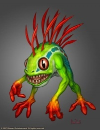

Мурло́ки (англ. Murlо́c) — раса рыболюдей из мира Warcraft. 
Популярность сделала их одним из символов компании Blizzard.
У мурлоков горбатое тело, сочетающее признаки рыбы и амфибии. 
Их культура примерно соответствует каменному веку. 
Жители суши мало знают об истории и убеждениях мурлоков, так как те появились на побережьях Азерота недавно.

Мурлоки не самые сильные или дружелюбные существа Азерота, 
и в серии Warcraft они выступают в роли врагов на первых этапах игры.
Их сила в количестве: мурлоки редко удаляются далеко от друг от друга и от воды, 
где обычно отдыхают или прячутся остальные соплеменники. Напав на одного мурлока, 
воин оказывается лицом к лицу со всей группой. 
Лишь несколько миссий в MMORPG «World of Warcraft» ставят игрока на сторону мурлоков. 

классный трек о мурлоках: 
https://www.youtube.com/watch?v=uOpdyytB3OY&ab_channel=Protocube 
